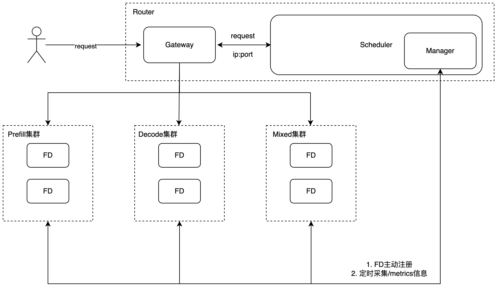

[简体中文](../zh/online_serving/router.md)

# Load-Balancing Scheduling Router

FastDeploy provides a Golang-based [Router](https://github.com/PaddlePaddle/FastDeploy/tree/develop/fastdeploy/golang_router) for request scheduling. The Router supports both centralized deployment and Prefill/Decode (PD) disaggregated deployment.。



## Installation

### 1. Python Command Line (Recommended)

The `fd-router` binary is bundled directly in the FastDeploy Python wheel package. After installing FastDeploy, you can launch the Router via the Python command line without any additional download or compilation:

```bash
# Start in mixed mode
python -m fastdeploy.golang_router.launch --port 9000

# Start in PD disaggregated mode
python -m fastdeploy.golang_router.launch --port 9000 --splitwise

# Start with a config file
python -m fastdeploy.golang_router.launch --config_path config.yaml

# Print version
python -m fastdeploy.golang_router.launch --version
```

### 2. Prebuilt Binary Download (Optional)

If you need to run the Router binary directly (e.g., without the Python environment), you can download the prebuilt binary:

```bash
wget https://paddle-qa.bj.bcebos.com/paddle-pipeline/FastDeploy_ActionCE/develop/latest/fd-router
chmod +x fd-router
mv fd-router /usr/local/bin/fd-router
```

Starting from FastDeploy v2.5.0, the official Docker images also include the precompiled Router binary at `/usr/local/bin/fd-router`. For installation details, please refer to the [FastDeploy Installation Guide](../get_started/installation/nvidia_gpu.md)

### 3. Build from Source

You need to build the Router from source in the following scenarios:

* Custom modifications to the Router are required
* The platform is not covered by the prebuilt binary

Environment Requirements:

* Go >= 1.21

Clone the FastDeploy repository and build the Router:
```bash
git clone https://github.com/PaddlePaddle/FastDeploy.git
cd FastDeploy/fastdeploy/golang_router
bash build.sh
```

## Centralized Deployment

Start the Router service. The `--port` parameter specifies the scheduling port for centralized deployment.
```bash
python -m fastdeploy.golang_router.launch --port 30000
```

Start a mixed inference instance. Compared to standalone deployment, specify the Router endpoint via `--router`. Other parameters remain unchanged.
```bash
export CUDA_VISIBLE_DEVICES=0
export FD_LOG_DIR="log_mixed"
python -m fastdeploy.entrypoints.openai.api_server \
   --model "PaddlePaddle/ERNIE-4.5-0.3B-Paddle" \
   --port 31000 \
   --router "0.0.0.0:30000"
```

## PD Disaggregated Deployment

Start the Router service with PD disaggregation enabled using the `--splitwise` flag.
```bash
python -m fastdeploy.golang_router.launch \
  --port 30000 \
  --splitwise
```

Launch a prefill instance. Compared with standalone deployment, add the `--splitwise-role` parameter to specify the instance role as Prefill, and add the `--router` parameter to specify the Router endpoint. All other parameters remain the same as in standalone deployment.
```bash
export CUDA_VISIBLE_DEVICES=0
export FD_LOG_DIR="log_prefill"
python -m fastdeploy.entrypoints.openai.api_server \
    --model "PaddlePaddle/ERNIE-4.5-0.3B-Paddle" \
    --port 31000 \
    --splitwise-role prefill \
    --router "0.0.0.0:30000"
```

Launch a decode instance.
```bash
export CUDA_VISIBLE_DEVICES=1
export FD_LOG_DIR="log_decode"
python -m fastdeploy.entrypoints.openai.api_server \
    --model "PaddlePaddle/ERNIE-4.5-0.3B-Paddle" \
    --port 32000 \
    --splitwise-role decode \
    --router "0.0.0.0:30000"
```

Once both Prefill and Decode instances are successfully launched and registered with the Router, requests can be sent:
```bash
curl -X POST "http://0.0.0.0:30000/v1/chat/completions" \
-H "Content-Type: application/json" \
-d '{
  "messages": [
    {"role": "user", "content": "hello"}
  ],
  "max_tokens": 100,
  "stream": false
}'
```

For more details on PD disaggregated deployment, please refer to the [Usage Guide](../features/disaggregated.md)

## CacheAware

The Load-Balancing Scheduling Router supports the CacheAware strategy, mainly applied to PD separation deployment to optimize request allocation and improve cache hit rate.

To use the CacheAware strategy, default configurations need to be modified. You can copy the configuration template and make adjustments (an example is available at [Router](https://github.com/PaddlePaddle/FastDeploy/tree/develop/fastdeploy/golang_router) directory under examples/run_with_config):
```bash
pushd examples/run_with_config
cp config/config.example.yaml config/config.yaml
popd
```

Launch the Router with the custom configuration specified via `--config_path`:
```bash
python -m fastdeploy.golang_router.launch \
  --port 30000 \
  --splitwise \
  --config_path examples/run_with_config/config/config.yaml
```

Prefill and Decode instance startup are the same as PD disaggregated deployment.

Launch the prefill instance.
```bash
export CUDA_VISIBLE_DEVICES=0
export FD_LOG_DIR="log_prefill"
python -m fastdeploy.entrypoints.openai.api_server \
    --model "PaddlePaddle/ERNIE-4.5-0.3B-Paddle" \
    --port 31000 \
    --splitwise-role prefill \
    --router "0.0.0.0:30000"
```

Launch the decode instance.
```bash
export CUDA_VISIBLE_DEVICES=1
export FD_LOG_DIR="log_decode"
python -m fastdeploy.entrypoints.openai.api_server \
    --model "PaddlePaddle/ERNIE-4.5-0.3B-Paddle" \
    --port 32000 \
    --splitwise-role decode \
    --router "0.0.0.0:30000"
```

## HTTP Service Description

The Router exposes a set of HTTP services to provide unified request scheduling, runtime health checking, and monitoring metrics, facilitating integration and operations.

| Method | Path | Description |
|----------|------|------|
| POST | `/v1/chat/completions` | Provide scheduling services for inference requests based on the Chat Completions API |
| POST | `/v1/completions` | Provide scheduling services for general text completion inference requests |
| POST | `/v1/abort_requests` | Abort inference requests to release GPU memory and compute resources. Accepts `req_ids` or `abort_all=true`. Returns aborted requests with their generated token counts |
| POST | `/register` | Allow inference instances to register their metadata with the Router for scheduling |
| GET | `/registered` | Query the list of currently registered inference instances |
| GET | `/registered_number` | Query the number of currently registered inference instances |
| GET | `/health_generate` | Check the health status of registered Prefill / Decode inference instances |
| GET | `/metrics` | Provide Prometheus-formatted Router runtime metrics for monitoring and observability |

## Deployment Parameters

### Router Startup Parameters

* --port: Specify the Router scheduling port.
* --splitwise: Enable PD disaggregated scheduling mode.
* --config_path: Specify the Router configuration file path for loading custom scheduling and runtime parameters.

### Configuration File Preparation

Before using `--config_path`, prepare a configuration file that conforms to the Router specification.
The configuration file is typically written in YAML format. For detailed parameters, refer to [Configuration Parameters](#configuration-parameters)。You may copy and modify the configuration template (example available at examples/run_with_config)：
```bash
cp config/config.example.yaml config/config.yaml
```

The Load-Balancing Scheduling Router also supports registering inference instances through configuration files at startup (example available at examples/run_with_default_workers):
```bash
cp config/config.example.yaml config/config.yaml
cp config/register.example.yaml config/register.yaml
```

### Configuration Parameters

config.yaml example:
```yaml
server:
  port: "8080" # Listening port
  host: "0.0.0.0" # Listening address
  mode: "debug" # Startup mode: debug, release, test
  splitwise: true # true enables PD disaggregation; false disables it

scheduler:
  policy: "power_of_two" # Scheduling policy (optional): random, power_of_two, round_robin, process_tokens, request_num, cache_aware, remote_cache_aware, fd_metrics_score, fd_remote_metrics_score
  prefill-policy: "cache_aware" # Prefill scheduling policy in PD mode
  decode-policy: "request_num" # Decode scheduling policy in PD mode
  eviction-interval-secs: 60 # Cache eviction interval for CacheAware scheduling
  eviction-duration-mins: 30 # Eviction duration for cache-aware radix tree nodes (minutes); default: 30
  balance-abs-threshold: 1 # Absolute threshold for CacheAware balancing
  balance-rel-threshold: 0.2 # Relative threshold for CacheAware balancing
  hit-ratio-weight: 1.0 # Cache hit ratio weight
  load-balance-weight: 0.05 # Load balancing weight
  cache-block-size: 4 # Cache block size
  # tokenizer-url: "http://0.0.0.0:8098" # Tokenizer service endpoint (optional), cache_aware uses character-level tokenization when not configured.
  #                                         Note: Enabling this option causes a synchronous remote tokenizer call on every scheduling decision,
  #                                         introducing additional network latency. Only enable it when precise token-level tokenization
  #                                         is needed to improve cache hit rate.
  # tokenizer-timeout-secs: 2 # Tokenizer service timeout; default: 2
  waiting-weight: 10 # Waiting weight for CacheAware scheduling
  stats-interval-secs: 5 # Stats logging interval in seconds, includes load and cache hit rate statistics; default: 5

manager:
  health-failure-threshold: 3 # Number of failed health checks before marking unhealthy
  health-success-threshold: 2 # Number of successful health checks before marking healthy
  health-check-timeout-secs: 5 # Health check timeout
  health-check-interval-secs: 5 # Health check interval
  health-check-endpoint: /health # Health check endpoint
  register-path: "config/register.yaml" # Path to instance registration config (optional)

log:
  level: "info"  # Log level: debug / info / warn / error
  output: "file" # Log output: stdout / file
```

register.yaml example：
```yaml
instances:
  - role: "prefill"
    host_ip: 127.0.0.1
    port: 8097
    connector_port: 8001
    engine_worker_queue_port: 8002
    transfer_protocol:
      - ipc
      - rdma
    rdma_ports: [7100, "7101"]
    device_ids: [0, "1"]
    metrics_port: 8003
  - role: "decode"
    host_ip: 127.0.0.1
    port: 8098
    connector_port: 8001
    engine_worker_queue_port: 8002
    transfer_protocol: ["ipc","rdma"]
    rdma_ports: ["7100", "7101"]
    device_ids: ["0", "1"]
```

Instance Registration Parameters：

* role: Instance role, one of: decode, prefill, mixed.
* host_ip: IP address of the inference instance host.
* port: Service port of the inference instance.
* connector_port: Connector port used for PD communication.
* engine_worker_queue_port: Shared queue communication port within the inference instance.
* transfer_protocol: Specify KV Cache transfer protocol, optional values: ipc / rdma, multiple protocols separated by commas
* rdma_ports: Specify RDMA communication ports, multiple ports separated by commas (only takes effect when transfer_protocol contains rdma)
* device_ids: GPU device IDs of the inference instance, multiple IDs separated by commas
* metrics_port: Port number of the inference instance's metrics

Among these, `role`, `host_ip`, and `port` are required; all other parameters are optional.

## Scheduling Strategies

The Router supports the following scheduling strategies, configurable via `policy` (mixed mode), `prefill-policy`, and `decode-policy` (PD disaggregated mode) fields in the configuration file.

**Default strategies**: When not configured, prefill nodes default to `process_tokens`, mixed and decode nodes default to `request_num`.

| Strategy | Applicable Scenario | Implementation |
|----------|---------------------|----------------|
| `random` | General | Randomly selects one available instance, stateless, suitable for lightweight scenarios. |
| `round_robin` | General | Uses atomic counter to cycle through instance list, distributing requests evenly in order. |
| `power_of_two` | General | Randomly picks two instances, compares their concurrent request counts, selects the one with lower load. |
| `process_tokens` | **prefill (default)** | Iterates all instances, selects the one with the fewest tokens currently being processed (in-memory counting), suitable for prefill long-request load balancing. |
| `request_num` | **mixed / decode (default)** | Iterates all instances, selects the one with the fewest concurrent requests (in-memory counting), suitable for decode and mixed scenarios. |
| `fd_metrics_score` | mixed / decode | Uses in-memory counting to get running/waiting request counts, scores by `running + waiting × waitingWeight`, selects the instance with the lowest score. |
| `fd_remote_metrics_score` | mixed / decode | Fetches running/waiting request counts from each instance's remote `/metrics` endpoint in real-time, scores by `running + waiting × waitingWeight`, selects the instance with the lowest score. Requires `metrics_port` in instance registration. **Note: A synchronous remote HTTP request is issued on every scheduling decision. With a large number of instances or poor network conditions, this can significantly increase scheduling latency. Evaluate your deployment conditions carefully before enabling this strategy.** |
| `cache_aware` | prefill | Maintains KV Cache prefix hit information per instance via Radix Tree, selects instances by combining hit ratio and load scores (in-memory counting); automatically falls back to `process_tokens` when load is severely imbalanced. |
| `remote_cache_aware` | prefill | Same cache-aware strategy as `cache_aware`, but uses remote `/metrics` endpoint for instance load data. Requires `metrics_port` in instance registration. **Note: A synchronous remote HTTP request is issued on every scheduling decision. With a large number of instances or poor network conditions, this can significantly increase scheduling latency. Evaluate your deployment conditions carefully before enabling this strategy.** |

## Troubleshooting

If you encounter issues while using the Router, please refer to the [Router Troubleshooting Guide](router_faq.md), which covers common log analysis, response output interpretation, and troubleshooting methods.
