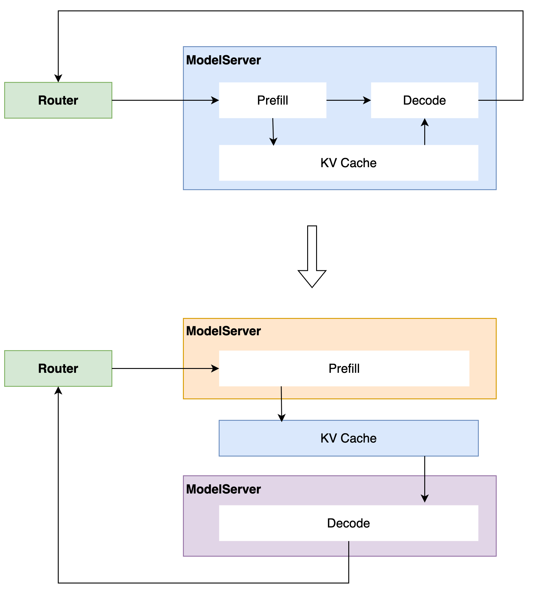

[English](../../features/disaggregated.md)

# 分离式部署

LLM大模型推理分为Prefill和Decode两个阶段，分别为计算密集型和访存密集型。

* Prefill阶段：处理输入的全部Token，完成模型的前向计算（Forward），生成首token。
* Decode阶段：基于首token和缓存的KV Cache，生成其他token；假定总共输出N个token，Decode阶段需要执行（N-1）次前向计算。

分离式部署是将Prefill和Decode部署在不同的计算资源上，各自使用最佳的配置，可以提高硬件利用率、提高吞吐、降低整句时延。

<p align="center">
  
</p>

分离式部署相比集中式部署，实现的核心差异在于KV Cache传输和请求调度。

## KV Cache 传输

在分离式部署中，请求在Prefill实例中生成的KV Cache，需要传输至Decode实例。FastDeploy提供了2种传输方式，分别针对单机内与多机间的场景。

单机内传输：通过cudaMemcpyPeer进行单机内两个GPU之间KV Cache传输。

多机间传输：使用自研的[RDMA传输库](https://github.com/PaddlePaddle/FastDeploy/tree/develop/fastdeploy/cache_manager/transfer_factory/kvcache_transfer)在多机之间传输KV Cache。

## PD 分离请求调度

针对PD分离式部署，FastDeploy提供Python版本[Router](https://github.com/PaddlePaddle/FastDeploy/tree/develop/fastdeploy/router)来实现请求收发和请求调度。使用方式和调度流程如下：
* 启动Router
* 启动PD实例，PD实例会注册到Router
* 用户请求发送到Router
* Router根据PD实例的负载情况为请求选择合适的PD实例对
* Router将请求发给选定的PD实例
* P实例收到请求后向D实例申请Cache Block
* P实例推理生成首token，同时layerwise传输Cache给D实例，完成后将首token发送给Router和D实例
* D实例收到请求和首token后，继续生成后续token，发送给Router
* Router接收PD实例的生成结果，返回给用户

高性能版本Router正在开发中，敬请期待。

## 使用说明

### 基于Router多机分离式部署

#### 环境准备
大家可以参考[文档](https://github.com/PaddlePaddle/FastDeploy/tree/develop/docs/zh/get_started/installation)准备环境，推荐使用Docker。
如果是自行准备运行环境，需要确保安装RDMA依赖包（librdmacm-dev libibverbs-dev iproute2）和驱动[MLNX_OFED](https://network.nvidia.com/products/infiniband-drivers/linux/mlnx_ofed/)。

```
apt update --fix-missing
apt-get install -y librdmacm-dev libibverbs-dev iproute2

# 下载并安装MLNX_OFED
./mlnxofedinstall --user-space-only --skip-distro-check --without-fw-update --force --without-ucx-cuda
```

拉取FastDeploy最新代码，编译安装（最新release 2.3和2.4版本还没有最新分离式部署的功能特性）。
```
git clone https://github.com/PaddlePaddle/FastDeploy
cd FastDeploy
bash build.sh
```

#### 部署服务

**快速上手**

启动Router服务，其中`--splitwise`参数指定为分离式部署的调度方式，日志信息输出在`log_router/router.log`。`fd-router`的安装方法参考[Router说明文档](../online_serving/router.md)。
```
export FD_LOG_DIR="log_router"
/usr/local/bin/fd-router \
    --host 0.0.0.0 \
    --port 30000 \
    --splitwise
```

启动Prefill实例。对比单机部署，增加`--splitwise-role`参数指定实例角色为Prefill，增加`--router`参数指定Router的接口，其他参数和单机部署相同。
```
export CUDA_VISIBLE_DEVICES=0
export FD_LOG_DIR="log_prefill"
python -m fastdeploy.entrypoints.openai.api_server \
    --model "PaddlePaddle/ERNIE-4.5-0.3B-Paddle" \
    --port 31000 \
    --splitwise-role prefill \
    --router "0.0.0.0:30000"
```

启动Decode实例。
```
export CUDA_VISIBLE_DEVICES=1
export FD_LOG_DIR="log_decode"
python -m fastdeploy.entrypoints.openai.api_server \
    --model "PaddlePaddle/ERNIE-4.5-0.3B-Paddle" \
    --port 32000 \
    --splitwise-role decode \
    --router "0.0.0.0:30000"
```

Prefill和Decode实例启动成功，并且向Router注册成功后，可以发送请求。
```
curl -X POST "http://0.0.0.0:30000/v1/chat/completions" \
-H "Content-Type: application/json" \
-d '{
  "messages": [
    {"role": "user", "content": "hello"}
  ],
  "max_tokens": 100,
  "stream": false
}'
```

**具体说明**

分离式部署启动Prefill/Decode实例的参数说明如下，其他参数设置和mixed部署类似，具体参考[文档](../../zh/parameters.md)：
* `--splitwise-role`: 指定实例角色，可选值为`prefill`，`decode`和`mixed`，默认是`mixed`
* `--cache-transfer-protocol`: 指定KV Cache传输协议，可选值为`rdma`和`ipc`，默认是`rdma,ipc`；PD实例在同一台机器，支持两种传输方式，优先使用`ipc`传输；PD实例不在同一台机器，只支持`rdma`传输；如果使用rdma传输，需要确保多台机器的RDMA网络互通
* `--rdma-comm-ports`: 指定RDMA通信端口，多个端口用逗号隔开，端口数量需要和dp_size*tp_size相同；可以不指定，FD内部会找空闲的端口
* `--pd-comm-port`: 指定PD实例的交互接口，多个端口用逗号隔开，端口数量需要和dp_size相同；可以不指定，FD内部会找空闲的端口
* `--router`：指定Router的服务地址

注意：
* 如果想手动指定RDMA网卡，可以设置`KVCACHE_RDMA_NICS`环境变量，多个网卡名用逗号隔开，Fastdeploy提供了检测RDMA网卡的脚本`bash FastDeploy/scripts/get_rdma_nics.sh <device>`, 其中 <device> 可以是 `cpu` 或 `gpu`。如果不设置`KVCACHE_RDMA_NICS`环境变量, Fastdeploy内部会自动检测可用的RDMA网卡。
* 分离式部署也可以使用[benchmark](../../../benchmarks/)工具向Router服务发请求，开启`--pd-metrics`参数可以统计到更多分析指标。
* 根据Decode实例的显存资源和最大处理请求数`max_num_seqs`来调整请求并发，如果请求并发很高但是Decode资源不足，Prefill会为特定请求持续向Decode申请资源，导致Prefill资源利用率过低；设置`export PREFILL_CONTINUOUS_REQUEST_DECODE_RESOURCES=0'来关闭该行为，特定请求遇到Decode资源不足会直接向Router返回错误。
* 分离式部署支持多种并行策略，如果使用DP并行，必须使用`python -m fastdeploy.entrypoints.openai.multi_api_server`来启动服务。

**Examples示例**

PD分离式部署支持前缀缓存、TP并行、DP并行等特性，具体examples可以参考[examples/splitwise](https://github.com/PaddlePaddle/FastDeploy/tree/develop/examples/splitwise)。

### 基于SplitwiseScheduler多机分离式部署

**注意：不推荐使用SplitwiseScheduler，推荐使用Router来做请求调度。**

#### 环境准备
* 使用`conda`安装

> **⚠️ 注意**
> **Redis 版本要求：6.2.0 及以上**
> 低于此版本可能不支持所需的命令。

```bash
# 安装
conda install redis
# 启动
nohup redis-server > redis.log 2>&1 &
```

* 使用`apt`安装

```bash
# 安装
sudo apt install redis-server -y
# 启动
sudo systemctl start redis-server
```

* 使用`yum`安装

```bash
# 安装
sudo yum install redis -y
# 启动
sudo systemctl start redis
```

#### 部署服务

多机部署时需要确认当前网卡是否支持RDMA，并且需要集群中所有节点网络互通。

**注意**：
* `KVCACHE_RDMA_NICS` 指定当前机器的RDMA网卡，多个网卡用逗号隔开。
* 仓库中提供了自动检测RDMA网卡的脚本 `bash scripts/get_rdma_nics.sh <device>`, 其中 <device> 可以是 `cpu` 或 `gpu`。

**prefill 实例**

```bash

export FD_LOG_DIR="log_prefill"
export CUDA_VISIBLE_DEVICES=0,1,2,3
export ENABLE_V1_KVCACHE_SCHEDULER=0
echo "set RDMA NICS"
export $(bash scripts/get_rdma_nics.sh gpu)
echo "KVCACHE_RDMA_NICS ${KVCACHE_RDMA_NICS}"
python -m fastdeploy.entrypoints.openai.api_server \
       --model ERNIE-4.5-300B-A47B-BF16 \
       --port 8180 --metrics-port 8181 \
       --engine-worker-queue-port 8182 \
       --cache-queue-port 8183 \
       --tensor-parallel-size 4 \
       --quantization wint4 \
       --cache-transfer-protocol "rdma,ipc" \
       --rdma-comm-ports "7671,7672,7673,7674" \
       --pd-comm-port "2334" \
       --splitwise-role "prefill" \
       --scheduler-name "splitwise" \
       --scheduler-host "127.0.0.1" \
       --scheduler-port 6379 \
       --scheduler-topic "test" \
       --scheduler-ttl 9000
```

**decode 实例**

```bash
export FD_LOG_DIR="log_decode"
export CUDA_VISIBLE_DEVICES=4,5,6,7
export ENABLE_V1_KVCACHE_SCHEDULER=0
echo "set RDMA NICS"
export $(bash scripts/get_rdma_nics.sh gpu)
echo "KVCACHE_RDMA_NICS ${KVCACHE_RDMA_NICS}"
python -m fastdeploy.entrypoints.openai.api_server \
       --model ERNIE-4.5-300B-A47B-BF16 \
       --port 8184 --metrics-port 8185 \
       --engine-worker-queue-port 8186 \
       --cache-queue-port 8187 \
       --tensor-parallel-size 4 \
       --quantization wint4 \
       --scheduler-name "splitwise" \
       --cache-transfer-protocol "rdma,ipc" \
       --rdma-comm-ports "7671,7672,7673,7674" \
       --pd-comm-port "2334" \
       --scheduler-host "127.0.0.1" \
       --scheduler-port 6379 \
       --scheduler-ttl 9000
       --scheduler-topic "test" \
       --splitwise-role "decode"
```

参数说明：

* --splitwise-role: 指定当前服务为prefill还是decode
* --cache-queue-port: 指定cache服务的端口，用于prefill和decode服务通信

多机参数说明：

* --cache-transfer-protocol: 指定KV Cache传输协议，支持ipc和rdma，默认ipc
* --scheduler-name: PD分离情况下为splitwise
* --scheduler-host: 连接的redis地址
* --scheduler-port: 连接的redis端口
* --scheduler-ttl: 指定redis的ttl时间，单位为秒
* --scheduler-topic: 指定redis的topic
* --pd-comm-port: 指定pd通信的端口
* --rdma-comm-ports: 指定RDMA通信的端口，多个端口用逗号隔开，数量与卡数一致
